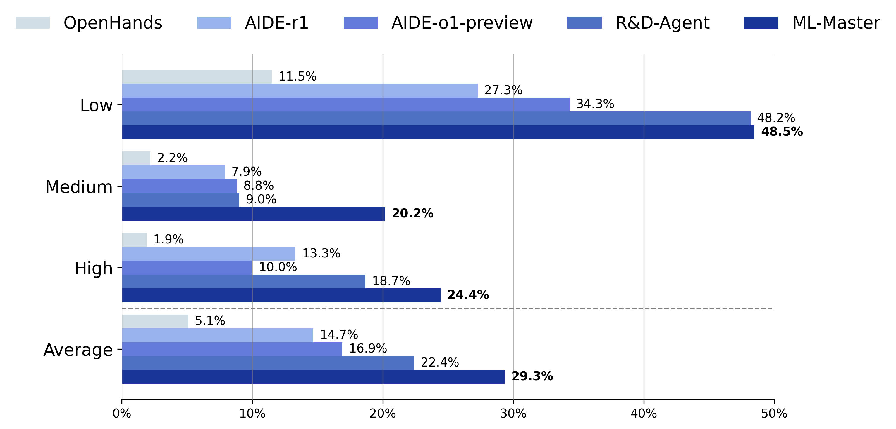

# ML-Master: Towards AI-for-AI via Intergration of Exploration and Reasoning

[](https://sjtu-sai-agents.github.io/ML-Master/)
[](https://arxiv.org/abs/2506.16499)
[](https://mp.weixin.qq.com/s/8Dn7Hvpmp59-0xDD28nQkw)

> **Status**: ⌛ Initial code release is now available!

## 🚀 Overview

**ML-Master** is a novel AI4AI (AI-for-AI) agent that integrates exploration and reasoning into a coherent iterative methodology, facilitated by an adaptive memory mechanism that selectively captures and summarizes relevant insights and outcomes, ensuring each component mutually reinforces the other without compromising either. 


## 📰 What's New
- [2025/08/08] Initial code release is now available on GitHub!
- [2025/06/19] Release the preprint version! See the [ArXiv](https://arxiv.org/abs/2506.16499).
- [2025/06/17] Release the initial version! See the initial manuscript [here](./assets/ML-Master_github.pdf).

## 📊 Performance Highlights

ML-Master outperforms prior baselines on the **[MLE-Bench](https://github.com/openai/mle-bench)**:

| Metric                      | Result                |
|----------------------------|-----------------------|
| 🥇 Average Medal Rate       | **29.3%**             |
| 🧠 Medium Task Medal Rate   | **20.2%**, more than doubling the previous SOTA            | 
| 🕒 Runtime Efficiency        | **12 hours**, 50% budget |




## 📆 Coming Soon
- [x] Grading report release
- [x] Paper release of ML-Master
- [x] Initial code release of ML-Master (expected early August)
- [ ] Code refactoring for improved readability and maintainability

## 🚀 Quick Start

### 🛠️ Environment Setup

To get started, make sure to first install the environment of **[MLE-Bench](https://github.com/openai/mle-bench)**. After that, install additional packages based on `requirements.txt`.

```bash
git clone https://github.com/sjtu-sai-agents/ML-Master.git
cd ML-Master
conda create -n ml-master python=3.12
conda activate ml-master

# 🔧 Install MLE-Bench environment here
# (Follow the instructions in its README)

pip install -r requirements.txt
```

---

### 📦 Download MLE-Bench Data

The full MLE-Bench dataset is over **2TB**. We recommend downloading and preparing the dataset using the scripts and instructions provided by **[MLE-Bench](https://github.com/openai/mle-bench)**.

Once prepared, the expected dataset structure looks like this:

```
/path/to/mle-bench/plant-pathology-2020-fgvc7/
└── prepared
    ├── private
    │   └── test.csv
    └── public
        ├── description.md
        ├── images/
        ├── sample_submission.csv
        ├── test.csv
        └── train.csv
```

> 🪄 ML-Master uses symbolic links to access the dataset. You can download the data to your preferred location and ML-Master will link it accordingly.

---

### 🧠 Configure DeepSeek and GPT

ML-Master requires LLMs to return custom `<think></think>` tags in the response. Ensure your **DeepSeek** API supports this and follows the `OpenAI` client interface below:

```python
self.client = OpenAI(
    api_key=self.api_key,
    base_url=self.base_url
)
response = self.client.completions.create(**params)
```

Set your `base_url` and `api_key` in the `run.sh` script.
**GPT-4o** is used *only* for evaluation and feedback, consistent with **[MLE-Bench](https://github.com/openai/mle-bench)**.

```bash
# Basic configuration
AGENT_DIR=./
EXP_ID=plant-pathology-2020-fgvc7   # Competition name
dataset_dir=/path/to/mle-bench      # Path to prepared dataset
MEMORY_INDEX=0                      # GPU device ID

# DeepSeek config
code_model=deepseek-r1
code_temp=0.5
code_base_url="your_base_url"
code_api_key="your_api_key"

# GPT config (used for feedback & metrics)
feedback_model=gpt-4o-2024-08-06
feedback_temp=0.5
feedback_base_url="your_base_url"
feedback_api_key="your_api_key"

# CPU allocation
start_cpu=0
CPUS_PER_TASK=36
end_cpu=$((start_cpu + CPUS_PER_TASK - 1))

# Time limit (in seconds)
TIME_LIMIT_SECS=43200
```

---

### ▶️ Start Running
Before running ML-Master, you need to launch a server which tells agent whether the submission is valid or not, allowed and used by MLE-Bench.
```bash
bash launch_server.sh
```

After that, simply run the following command:

```bash
bash run.sh
```

📝 Logs and solutions will be saved in:

* `./logs` (for logs)
* `./workspaces` (for generated solutions)

---
### 📊 Evaluation

For evaluation details, please refer to the official **[MLE-Bench evaluation guide](https://github.com/openai/mle-bench)**.


## 🙏 Acknowledgements

We would like to express our sincere thanks to the following open-source projects that made this work possible:

* 💡 **[MLE-Bench](https://github.com/openai/mle-bench)** — for providing a comprehensive and professional AutoML benchmarking platform.
* 🌲 **[AIDE](https://github.com/WecoAI/aideml)** — for offering a powerful tree-search-based AutoML code framework that inspired parts of our implementation.


## ✍️ Citation

If you find our work helpful, please use the following citations.

```bibtex
@misc{liu2025mlmasteraiforaiintegrationexploration,
      title={ML-Master: Towards AI-for-AI via Integration of Exploration and Reasoning}, 
      author={Zexi Liu and Yuzhu Cai and Xinyu Zhu and Yujie Zheng and Runkun Chen and Ying Wen and Yanfeng Wang and Weinan E and Siheng Chen},
      year={2025},
      eprint={2506.16499},
      archivePrefix={arXiv},
      primaryClass={cs.AI},
      url={https://arxiv.org/abs/2506.16499}, 
}
```